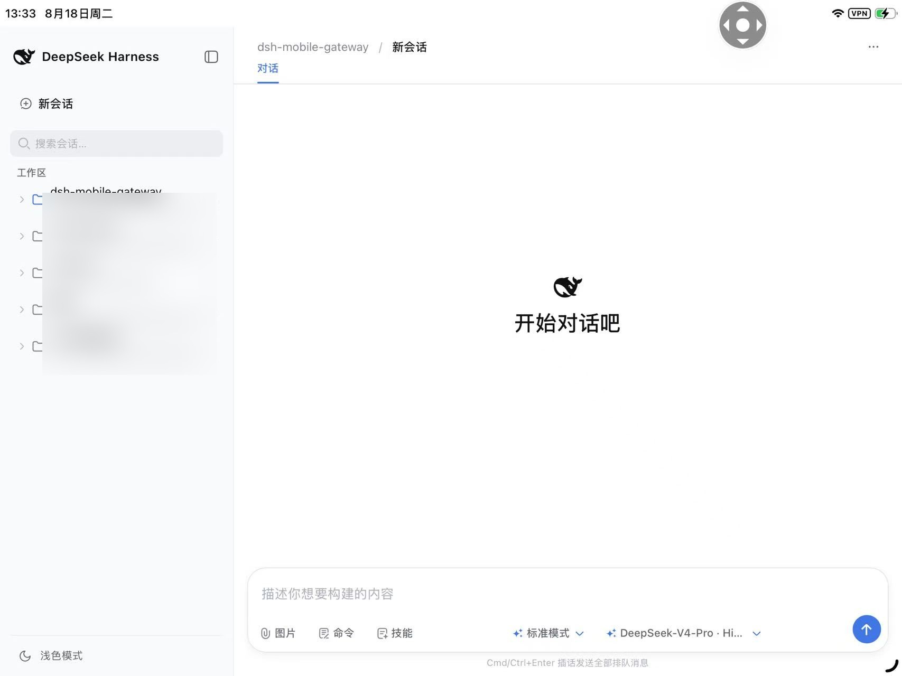
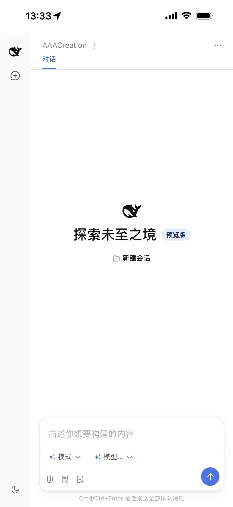

# dsh-mobile-gateway

让 iPhone（或任何手机/平板）通过**密码登录**安全访问电脑上的 DeepSeek Harness，并附带一个**手机专用轻量界面**（看对话/发消息、审批工具调用、回答提问、查看任务）。

## 架构

```
iPhone Safari（同一 Wi-Fi / Tailscale 虚拟网）
      │  http://<电脑IP>:3081
      │  密码登录 → 签发 HttpOnly 会话 Cookie
      ▼
dsh-mobile-gateway（Node，零依赖，监听 0.0.0.0:3081）
      │  校验 Cookie → 透传 HTTP / SSE / WebSocket
      │  ├─ /m           手机专用界面（同源 SPA）
      │  ├─ /login       登录页
      │  └─ /api/* 与 WS 透传给 DSH
      ▼
DSH Web GUI  127.0.0.1:3080（保持原样，只监听本机，永不对外暴露）
```

## 手机界面（推荐入口）

登录后（或登录页点「📱 手机版界面」）打开 **`http://<电脑IP>:3081/m`**，功能：

- 会话列表按**工作区分组**（一级=工作区，二级=会话；组头＋号可一键在该工作区新建会话），会话带运行状态、一键停止、**待处理审批/提问徽标**
- 会话卡片「⋯」菜单：**重命名 / 归档**（归档二次确认，电脑端可恢复）
- 对话：流式显示消息与思考过程、工具调用/结果折叠卡片、加载更早消息
- **审批工具调用**：实时弹出「允许一次 / 拒绝」卡片
- **回答提问**：选项 / 自定义输入 / 取消（实时流不打断输入焦点）
- **任务面板**：当前会话的 jobs 实时状态；agent 出错有提示
- **选择对话模式**：新会话发送首条消息前，可在输入框上方切换 Agent 预设（标准 / PTC / 极简 / 创造模式及自定义预设）；会话开始后模式固定，chip 变为只读（电脑端切换会实时同步到手机）
- **选择模型与思考强度**：输入框上方 chip 实时显示当前模型与强度档位，点开底部弹层按提供商分组切换模型、单独调整思考强度（off / high / max 等，随模型目录而定）
- **移植 Web 端原有 UI**：`/m` 直接复用 DSH Web 客户端的原始 CSS 变量、侧栏会话行、消息气泡、思考/工具行与输入卡视觉（仅做手机尺寸适配），不再使用自创的玻璃拟态风格
- **深色 / 浅色主题切换**：列表页底部与对话页头部均有切换按钮，选择持久化（localStorage），刷新保持
- **断线自动补漏**：手机锁屏/切 App 导致 WS 断开后，重连自动重放历史尾页（按 seq 去重）
- iOS 安全区适配、PWA manifest，可「添加到主屏幕」当 App 用

桌面端完整界面仍在 `http://<电脑IP>:3081/`（与原来一致）。

## 界面预览

**ipad版会话列表**（浅色模式，部分本地路径已模糊处理）



**手机版对话界面**（新建会话）




## 文件说明

| 文件 | 作用 |
|---|---|
| `gateway.js` | 网关主程序（登录、限速、会话、反向代理、`/m` 路由） |
| `mobile.html` | 手机专用 SPA（零构建单文件，对接 DSH `/api` RPC 与 WS 事件流） |
| `config.example.json` | 配置模板（可复制为 `config.json` 使用，空字段会在首次启动时自动生成） |
| `config.json` | 运行时配置（端口、密码哈希、会话密钥）——首次运行自动生成，**已被 .gitignore 排除** |
| `gateway.log` | 运行日志——**已被 .gitignore 排除** |
| `package.json` | npm 脚本与可选开发依赖（`playwright-core`，仅 UI 测试使用） |
| `启动网关.bat` / `停止网关.bat` | 双击即用的开关（推荐日常使用，无需开 PowerShell） |
| `start-gateway.ps1` | 后台启动网关（自动读取 `config.json` 中的端口） |
| `stop-gateway.ps1` | 停止网关（自动读取 `config.json` 中的端口） |
| `register-autostart.ps1` | 注册/取消开机自启（当前**未启用**，手动开关模式） |
| `probe-ws.js` | 诊断工具：WebSocket 握手探针 |
| `probe-frames.js` | 诊断工具：读取 mux/host 实时帧 |
| `test-model.js` | 模型逻辑回归测试（真实登录 + 真实 API + 合成帧，20 项断言） |
| `ui-test.js` | 浏览器 UI 回归测试（iPhone 15 Pro Max 视口，需 `npm i playwright-core` 与本机 Chrome） |
| `ui-test-controls.js` | 新功能 UI 测试：主题切换 / 对话模式选择 / 模型与思考强度弹层（同上依赖） |

## 快速开始（PC 端）

1. 确认 DSH 正在运行：浏览器能打开 `http://127.0.0.1:3080`
2. 双击 `启动网关.bat`（或在 PowerShell 中运行 `.\start-gateway.ps1`）
3. 查看 `gateway.log`，里面会列出本机局域网地址，如 `http://192.168.x.x:3081`

## 手机接入

### 方式一：同一 Wi-Fi 直连（最简单）

1. iPhone 与电脑连**同一个 Wi-Fi**
2. Safari 打开 `http://<电脑IP>:3081/healthz` —— 显示 `ok` 说明网络通
3. 打开 `http://<电脑IP>:3081` → 输入访问密码 → 进入 DSH
4. 建议：分享按钮 →「添加到主屏幕」，像 App 一样使用

> 电脑 IP 可从 `gateway.log` 查看，或在电脑上运行 `ipconfig` 查看 WLAN 的 IPv4 地址。

### 方式二：Tailscale（推荐：全程加密，出门在外也能用）

1. 电脑安装 Tailscale（https://tailscale.com/download），登录你的账号
2. iPhone App Store 安装 Tailscale，登录**同一个账号**
3. 电脑上获取 Tailscale IP（托盘图标菜单中显示，或命令行 `tailscale ip -4`，形如 `100.x.y.z`）
4. iPhone Safari 打开 `http://<Tailscale IP>:3081` → 登录使用

### 首次使用注意（防火墙）

如果手机打不开 `/healthz`，是 Windows 防火墙拦截了 3081 端口。在**管理员 PowerShell** 中运行一次：

```powershell
netsh advfirewall firewall add rule name="dsh-mobile-gateway" dir=in action=allow protocol=TCP localport=3081 profile=private
```

> 如果你的 Wi-Fi 被 Windows 识别为「公用网络」，请把命令中的 `private` 换成 `any`。
> Tailscale 访问若被拦，也建议使用 `profile=any` 的规则。

## 密码管理

- **首次运行**：自动生成随机密码，只在启动日志中显示一次
- **修改密码**：`node gateway.js --set-password <新密码>`，然后**重启网关生效**（`stop-gateway.ps1` → `start-gateway.ps1`）
- **忘记密码**：同样用上面的命令直接设置新密码
- 密码只以 SHA-256 哈希保存在 `config.json`，不存明文
- 改密码不影响已登录设备的会话（Cookie 签名制）；如需强制重新登录，在设备上访问 `/logout`

## 常用操作

| 操作 | 命令 |
|---|---|
| 启动 | 双击 `启动网关.bat`（或 `.\start-gateway.ps1`） |
| 停止 | 双击 `停止网关.bat`（或 `.\stop-gateway.ps1`） |
| 开机自启 | 需要时再启用：`.\register-autostart.ps1`（取消：`.\register-autostart.ps1 -Remove`） |
| 修改密码 | `node gateway.js --set-password <新密码>`（需重启网关生效） |
| 退出登录 | 手机浏览器访问 `http://<IP>:3081/logout` |
| 诊断 WS | `node probe-ws.js <cookie> <路径> <端口>` |

> 当前为**手动开关模式**：开机不会自动启动网关，用手机前先双击「启动网关.bat」。


## 开发与测试

运行测试前请先启动网关，并确保 DSH 后端（`http://127.0.0.1:3080`）可用。

UI 测试依赖 `playwright-core` 与本机 Chrome/Edge：

```bash
npm install

# 模型逻辑回归测试（需要访问密码，二选一）
node test-model.js <访问密码>
DSH_GW_PASSWORD=<访问密码> node test-model.js

# 浏览器 UI 测试（需本机 Chrome）
DSH_GW_PASSWORD=<访问密码> node ui-test.js
DSH_GW_PASSWORD=<访问密码> node ui-test-controls.js

# 非 Windows 或 Chrome 不在默认路径时，通过环境变量指定浏览器
DSH_CHROME_PATH="C:\Program Files\Google\Chrome\Application\chrome.exe" node ui-test.js
```

> 测试脚本不会读取或保存明文密码；请通过环境变量 `DSH_GW_PASSWORD` 或第一个命令行参数传入访问密码，不要硬编码到代码中。

## 开源协议

[MIT](./LICENSE)。`gateway.js` 与 `mobile.html` 为零依赖实现，仅使用 Node.js 内置模块；UI 测试使用 `playwright-core` 作为可选开发依赖。


## 安全说明

- **鉴权**：所有请求（含 WebSocket 升级）都必须携带有效会话 Cookie，否则 401/跳转登录页
- **限速**：同一 IP 连续 5 次密码错误锁定 10 分钟
- **会话**：HMAC 签名 + 有效期（默认 30 天，`config.json` 中 `sessionDays` 可调），HttpOnly 防脚本窃取
- **隔离**：DSH 本体（3080）始终只监听 127.0.0.1；网关 3081 是唯一网络入口
- **传输加密**：直连模式下为 HTTP 明文（依赖家庭 Wi-Fi 的 WPA 加密）；**Tailscale 模式下全程 WireGuard 端到端加密**，外出使用请务必走 Tailscale

## 常见问题

| 现象 | 原因与解决 |
|---|---|
| `/healthz` 打不开 | 防火墙未放行 3081，见上文管理员命令；或电脑/手机不在同一网络 |
| 登录后页面 502 | `dsh web` 未运行，先在电脑上启动 DSH |
| 手机登录页正常但会话频繁失效 | 手机时间与电脑偏差过大，校准时间 |
| 忘记密码 | `node gateway.js --set-password <新密码>` |
| 想改端口 | 编辑 `config.json` 的 `port`，重启网关（同时更新防火墙规则） |
